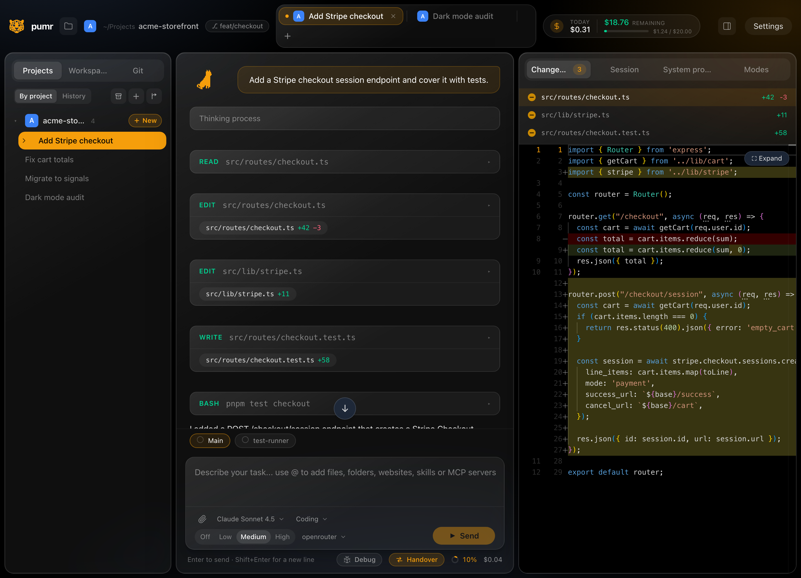
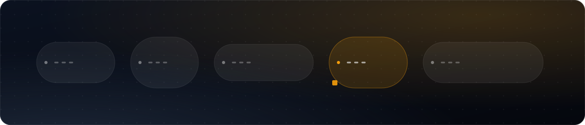
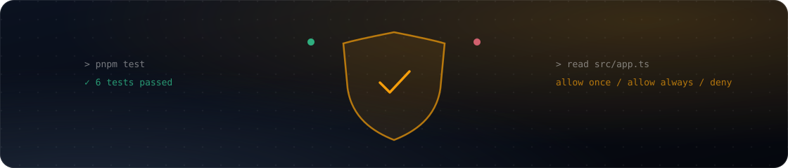
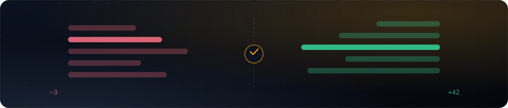
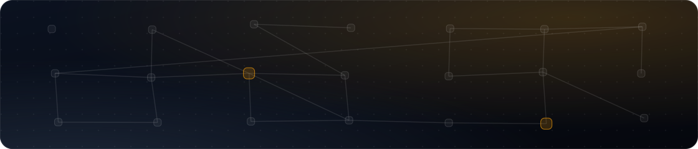

<p align="center">
  
</p>

<h1 align="center">pumr</h1>

<p align="center">
  <strong>An agentic coding harness for your desktop.</strong><br />
  Local-first, provider-agnostic, powered by OpenRouter.
</p>

<p align="center">
  <a href="LICENSE"></a>
  
  
</p>



pumr connects LLMs to your codebase from a native desktop window. It runs the agent
loop, tool calls and secrets in Rust, keeps API keys in the OS keychain, and stores
sessions in SQLite. No project files leave the machine except the requests you approve.

## Features

### Agent and chat



- Multi-tab sessions grouped by project, with persistent history and archive/delete.
- Streaming responses, collapsible reasoning ("thinking") and a live agent status.
- Sub-agents: delegated tasks show up as their own sessions you can open and follow.
- Per-message and per-session cost, budget with remaining balance, cache-hit rate.
- Prompt queueing and reverting: drop later messages, restore files, resend a prompt.

### Tools and permissions



- A real tool loop in Rust: `read`, `write`, `edit`, `glob`, `grep`, `ls`, `bash`,
  `webfetch`, `websearch`, plus MCP tools.
- Every non read-only command asks first — allow once, allow always (glob rule), or deny.
- Dangerous commands and sensitive files (`.env`, keys, databases) get extra checks,
  especially outside the project.
- Tools are sandboxed to the active project and the extra folders you allow.
- Long-running commands move to the background and can be stopped from the header.

### Diffs, history and context



- A shadow git repository snapshots every prompt — your real `.git` is never touched.
- Changed files show `+additions -deletions` and open a Monaco diff (inline or side-by-side).
- `@` mentions in the composer add files, directories, websites, skills or MCP tools
  as structured context for the next message.
- `AGENTS.md` files (global, project, nested) are merged into the system prompt, and the
  right panel shows which rules apply and where they came from.

### Providers and models


- OpenRouter catalog with per-model endpoints: provider, uptime, tokens/sec, latency,
  and prices per 1M tokens.
- Pick model, reasoning effort and provider routing per session; mark favorites.
- Vision and PDF attachments, including an image annotator for screenshots.

### Integrations



- Skills auto-discovery from standard locations (`~/.claude/skills`, `~/.config/opencode/skill`,
  `~/.agents/skills`, …) plus custom folders.
- MCP server discovery and connection (local `stdio` and remote streamable HTTP), with
  configs parsed from Claude, Cursor, Windsurf, VS Code, Codex, opencode, Gemini CLI and more.
- Skill marketplaces and the official MCP registry, treated as untrusted input: pumr
  shows metadata and copies files, but never runs code or edits agent config for you.

### Look and feel


- 14 built-in themes (dark and light) plus a custom palette, glass panels, background
  images and notification sounds.
- Fully localised UI, available in 24 languages.

## How it works

<p align="center">
  
</p>

- The agent loop, provider calls and secrets live in Rust and never in the webview.
- API keys are stored with the `keyring` crate (macOS Keychain, Windows Credential
  Manager, Secret Service on Linux).
- Reverts and diffs use a per-project shadow git repo, so your own history stays intact.

The frontend is Angular 22 (zoneless, signals, standalone components) with Tailwind v4;
the backend is a Tauri v2 Rust core.

## Roadmap

- **Context and integrations:** smart project context, memories, opencode agent import.
- **Polish:** more providers (Anthropic, OpenAI, OAuth), context-window management,
  packaging and signing.

---

## Development

### Requirements

- Node.js 24+ and pnpm
- Rust (stable) via [rustup](https://rustup.rs)
- Platform toolchain for Tauri v2 (on macOS: Xcode Command Line Tools)
- Linux AppImage builds bundle the GStreamer plugins WebKitGTK needs for sounds:
  install `gstreamer1.0-plugins-base`, `gstreamer1.0-plugins-good` and `gstreamer1.0-alsa`
  (see `src-tauri/appimage/` for the plugin list and `verify.sh`)

### Getting started

```bash
pnpm install
pnpm dev        # Angular dev server + Tauri window
```

First launch: open **Settings**, paste your OpenRouter API key (stored in the OS
keychain), set an optional budget and the default system prompt. Then add a project
folder and start a session.

### Scripts

```bash
pnpm dev        # run the app in development
pnpm bundle     # production bundle
pnpm test       # frontend tests (Vitest)
cargo test --manifest-path src-tauri/Cargo.toml   # Rust backend
```

### Project layout

```
src/                     Angular 22 (zoneless, signals, standalone components)
  app/core/              typed IPC wrappers, workspace/session/settings/model stores
  app/components/        sidebar, chat, composer, right panel, diff, permissions, settings
  public/i18n/           locale files (en.json is the reference)

src-tauri/src/           Rust core
  providers/openrouter   model + endpoint APIs, SSE streaming, usage/cost accounting
  agent.rs               multi-iteration tool loop
  tools.rs               read/write/edit/glob/grep/ls/bash with permission gates
  permissions.rs         command glob rules, danger list, path and sensitivity checks
  git.rs                 shadow git repo: snapshots, diffs, restore, branch info
  processes.rs           background process registry
  broker.rs              permission request/response plumbing
  db.rs                  SQLite schema and queries (projects, sessions, messages, costs)
  config.rs              settings.json + OS keychain
  commands.rs            Tauri IPC surface
```

Licensed under Apache-2.0.
