<p align="center">
  
</p>

<h1 align="center">pumr</h1>

<p align="center">
  <strong>An agentic coding harness for your desktop.</strong><br />
  Local-first, provider-agnostic: OpenRouter, Anthropic, OpenAI, Gemini and 190+ more
  providers from models.dev, or a local model server.
</p>

<p align="center">
  <a href="LICENSE"></a>
  
  
</p>

<p align="center">
  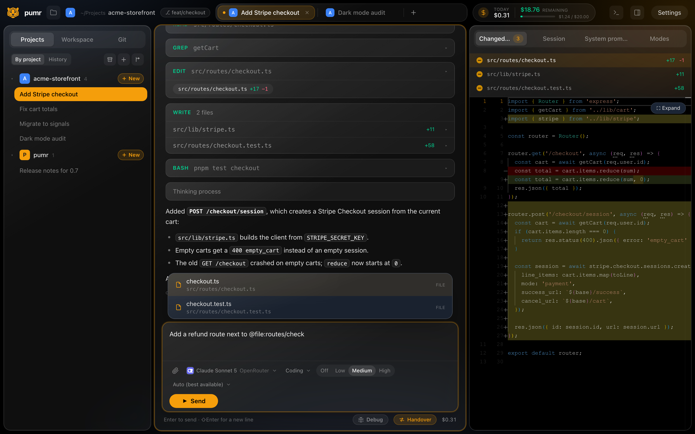
</p>

pumr connects LLMs to your codebase from a native desktop window. It runs the agent
loop, tool calls and secrets in Rust, keeps API keys in the OS keychain, and stores
sessions in SQLite. No project files leave the machine except the requests you approve.

## Features

### Agent and chat

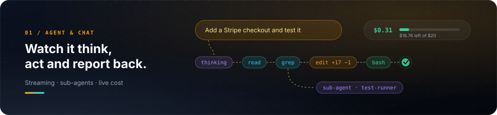

<table>
<tr>
<td width="42%" valign="top">
  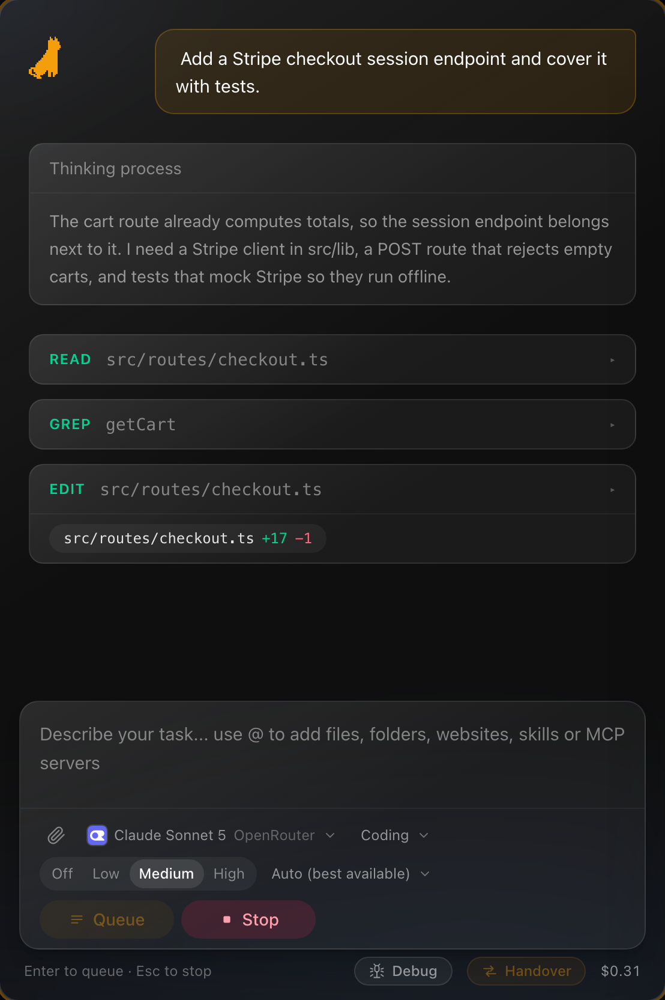
</td>
<td valign="top">

- Multi-tab sessions grouped by project, with persistent history and archive/delete.
- Streaming responses, collapsible reasoning ("thinking") and a live agent status.
- Sub-agents: delegated tasks show up as their own sessions you can open and follow.
- Per-message and per-session cost, budget with remaining balance, cache-hit rate.
- Prompt queueing and reverting: drop later messages, restore files, resend a prompt.
- Export a chat's debug log as Markdown, with OS and app versions, every step, errors and
  permission decisions, to hand to an AI agent. A model you pick can anonymize it first.

</td>
</tr>
</table>

### Tools and permissions

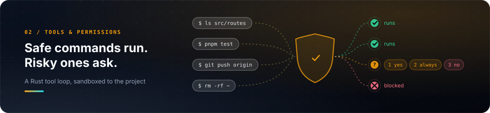

<table>
<tr>
<td valign="top">

- A real tool loop in Rust: `read`, `write`, `edit`, `glob`, `grep`, `ls`, `bash`,
  `webfetch`, `websearch`, plus MCP tools.
- Non-dangerous commands inside the project just run. When a prompt does appear it
  shows the command, why it asks and numbered choices, like Claude Code: yes; yes
  and don't ask again for `git push *` (this chat, or always); no. The scope can be
  changed under Customize. One grant auto-approves every queued request it covers,
  one deny clears the queue.
- Dangerous commands and sensitive files (`.env`, keys, databases) get extra checks,
  especially outside the project. Inline code (`bash -c`, `node -e`), package
  downloads (`npx`) and hosts that `curl`, `git` or `ssh` contact always ask; network
  commands follow the same website allow/deny list as the web tools.
- Strict, Balanced and Autonomous presets pick what runs without asking, and the
  debugger's Permissions view records every decision and why it was made.
- Tools are sandboxed to the active project and the extra folders you allow.
- Long-running commands move to the background and can be stopped from the header.

</td>
<td width="42%" valign="top">
  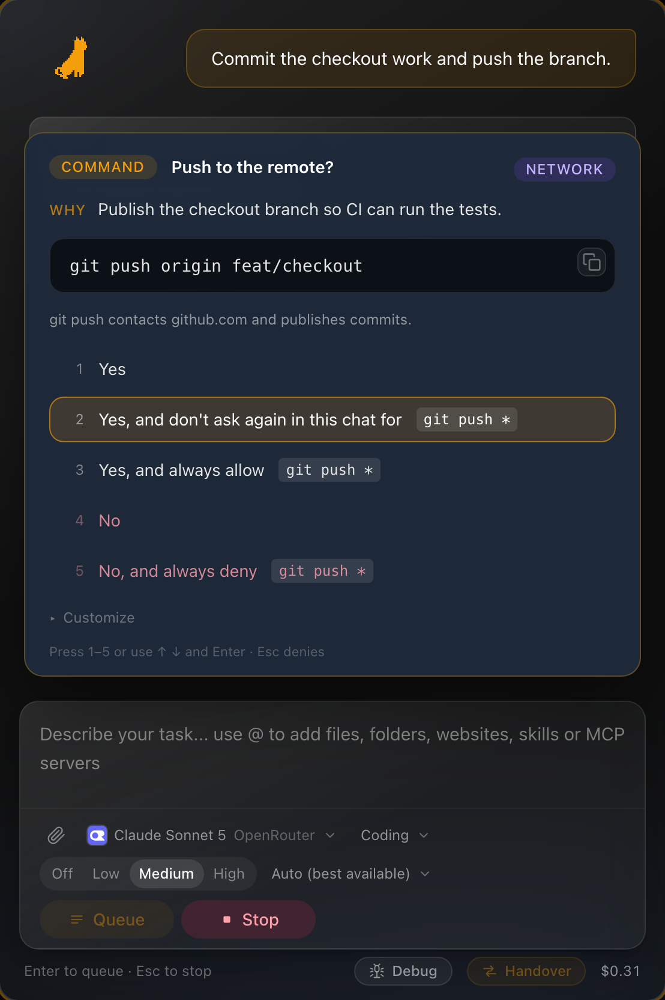
</td>
</tr>
</table>

### Diffs, history and context

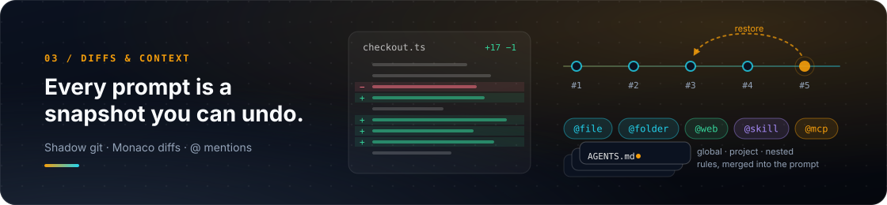

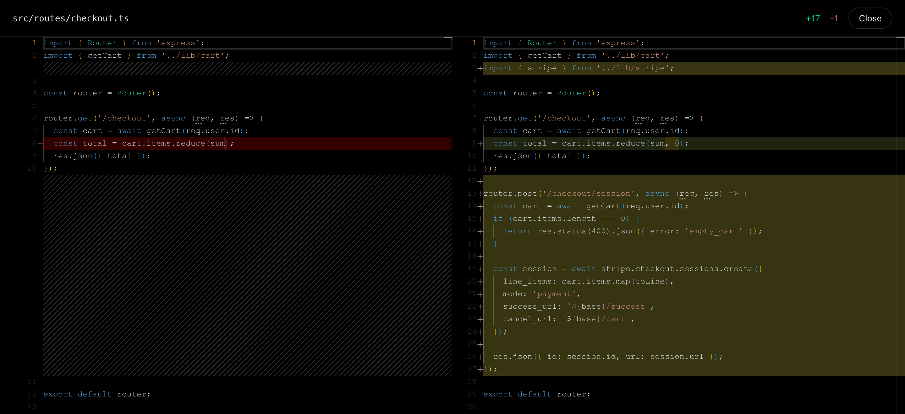

- A shadow git repository snapshots every prompt — your real `.git` is never touched.
- Changed files show `+additions -deletions` and open a Monaco diff (inline or side-by-side).
- `@` mentions in the composer add files, directories, websites, skills or MCP tools
  as structured context for the next message.
- `AGENTS.md` files (global, project, nested) are merged into the system prompt, and the
  right panel shows which rules apply and where they came from.

### System prompts and modes

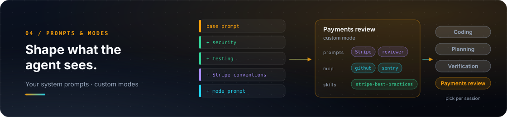

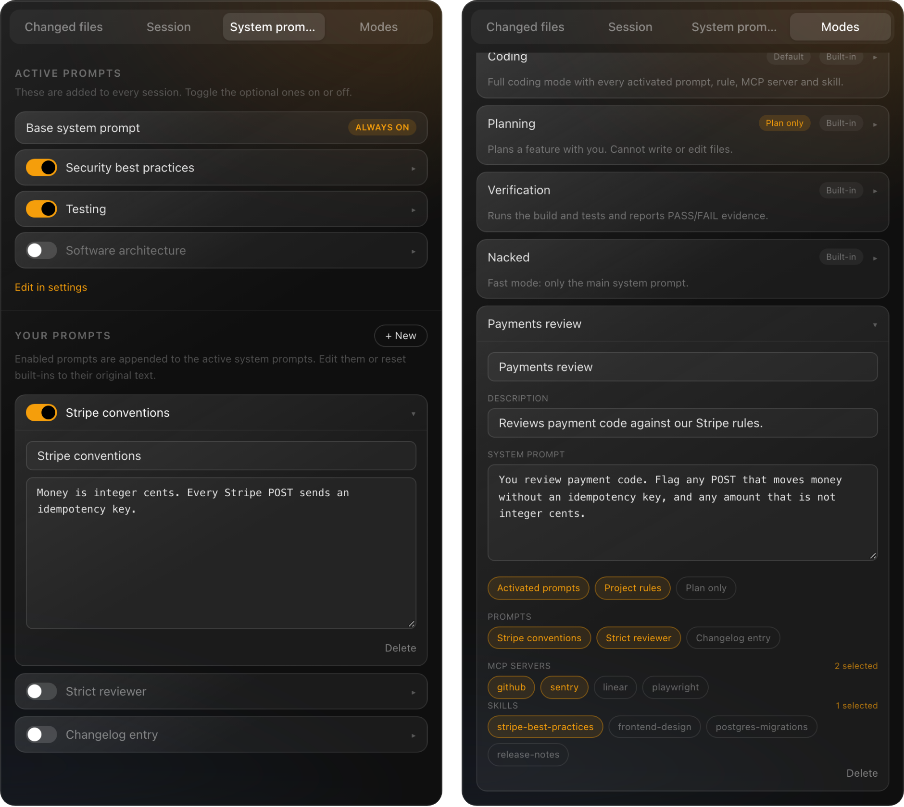

- Edit the base system prompt in Settings (with a reset to default) and switch the built-in
  Security, Testing and Software architecture prompts on or off.
- Write your own prompts in the right panel: name them, edit them and choose which ones are
  appended to every session.
- Modes decide what the agent sees. Each mode has its own system prompt and picks which of
  your prompts, MCP servers and skills it loads, whether the activated global prompts and
  project rules (`AGENTS.md`) apply, and whether it may only plan instead of editing files.
- Built-in modes: Coding (everything activated), Planning (plans with you, cannot write or
  edit files), Verification (runs the build and tests and reports PASS/FAIL/BLOCKED without
  changing code) and Nacked (base prompt only, for speed). Edit or reset them, or add your own.
- Pick a mode per session in the composer; new sessions start in the default mode. The
  debugger shows how the system prompt was put together: base, global prompts and mode prompt.

### Providers and models

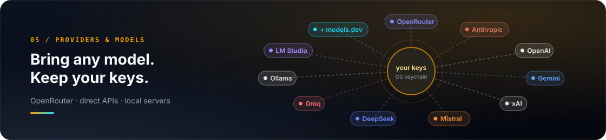

<table>
<tr>
<td width="42%" valign="top">
  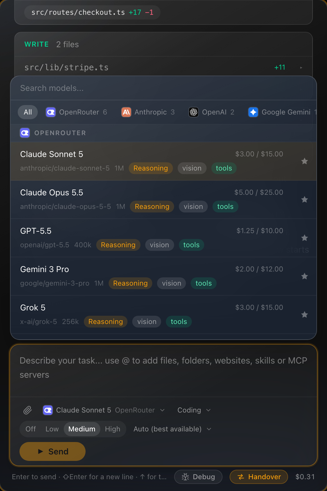
</td>
<td valign="top">

- OpenRouter catalog with per-model endpoints: provider, uptime, tokens/sec, latency,
  and prices per 1M tokens.
- Direct providers with your own key: Anthropic (Messages API, with adaptive thinking and
  prompt caching), OpenAI, Google Gemini, xAI, Mistral, DeepSeek and Groq built in, local
  Ollama and LM Studio servers, and every OpenAI- or Anthropic-compatible provider in
  [models.dev](https://models.dev) (the catalog opencode uses): Together, Fireworks,
  DeepInfra, Cerebras, Hugging Face, Moonshot, Z.AI, MiniMax, Alibaba, Vercel AI Gateway,
  OpenCode Zen and many more. The catalog is cached and refreshed daily; prices, context
  windows and capabilities of direct models come from it (or the OpenRouter catalog).
- The model picker groups models by provider, with a filter per provider, and the
  composer always shows which provider the selected model runs on.
- Pick model, reasoning effort and provider routing per session; mark favorites.
- Vision and PDF attachments, including an image annotator for screenshots.

</td>
</tr>
</table>

### Integrations

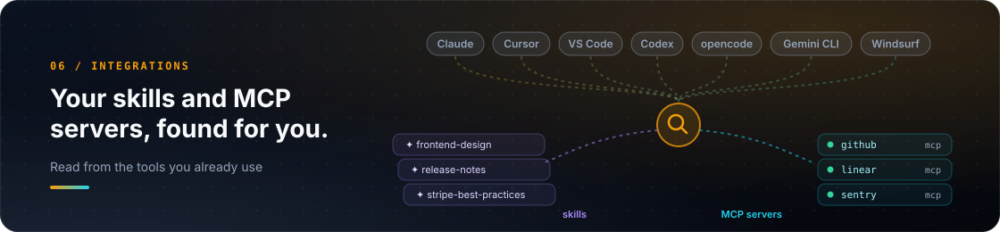

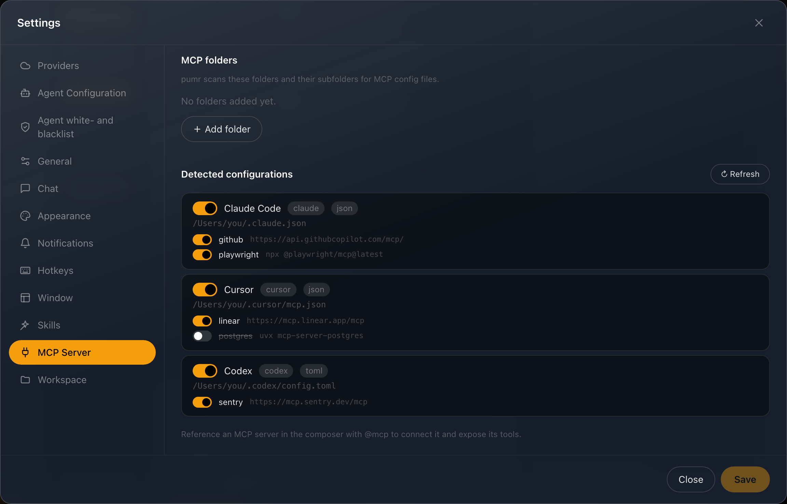

- Skills auto-discovery from standard locations (`~/.claude/skills`, `~/.config/opencode/skill`,
  `~/.agents/skills`, …) plus custom folders.
- MCP server discovery and connection (local `stdio` and remote streamable HTTP), with
  configs parsed from Claude, Cursor, Windsurf, VS Code, Codex, opencode, Gemini CLI and more.
- Skill marketplaces and the official MCP registry, treated as untrusted input: pumr
  shows metadata and copies files, but never runs code or edits agent config for you.

### Look and feel

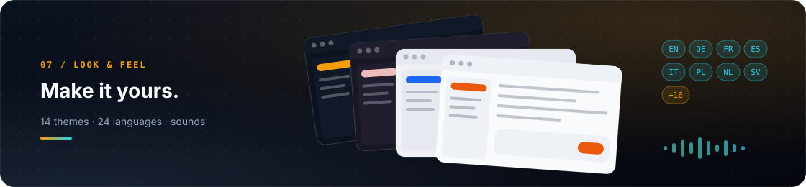

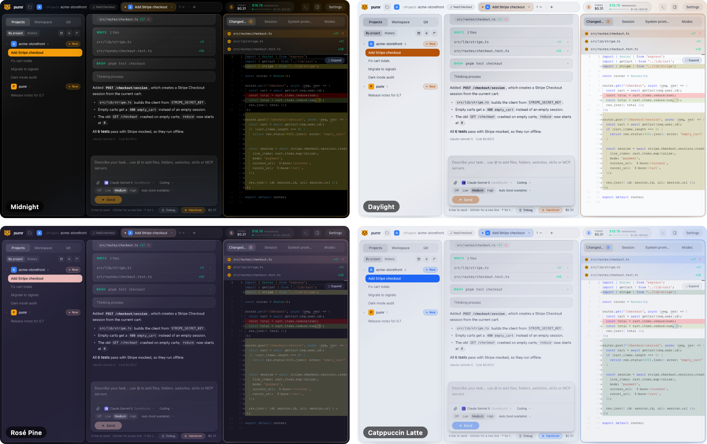

- 14 built-in themes (dark and light) plus a custom palette, glass panels, background
  images and notification sounds.
- Fully localised UI, available in 24 languages.

## How it works

<p align="center">
  
</p>

- The agent loop, provider calls and secrets live in Rust and never in the webview.
- API keys are stored with the `keyring` crate (macOS Keychain, Windows Credential
  Manager, Secret Service on Linux).
- Reverts and diffs use a per-project shadow git repo, so your own history stays intact.

The frontend is Angular 22 (zoneless, signals, standalone components) with Tailwind v4;
the backend is a Tauri v2 Rust core.

## Roadmap

- **Context and integrations:** smart project context, memories, opencode agent import.
- **Polish:** OpenAI Responses API models (`-pro`, codex), Bedrock/Vertex, context-window management,
  packaging and signing.

---

## Development

### Requirements

- Node.js 24+ and pnpm
- Rust (stable) via [rustup](https://rustup.rs)
- Platform toolchain for Tauri v2 (on macOS: Xcode Command Line Tools)
- Linux AppImage builds bundle the GStreamer plugins WebKitGTK needs for sounds:
  install `gstreamer1.0-plugins-base`, `gstreamer1.0-plugins-good` and `gstreamer1.0-alsa`
  (see `src-tauri/appimage/gstreamer-plugins.txt`)

### Getting started

```bash
pnpm install
pnpm dev        # Angular dev server + Tauri window
```

First launch: open **Settings → Providers** and connect at least one provider: paste its
API key (stored in the OS keychain) or turn on a local server. Set an optional budget and
the default system prompt, then add a project folder and start a session.

### Scripts

```bash
pnpm dev        # run the app in development
pnpm bundle     # production bundle
pnpm test       # frontend tests (Vitest)
pnpm docs:screenshots   # regenerate the README screenshots in docs/
pnpm docs:banners       # regenerate the README feature banners
cargo test --manifest-path src-tauri/Cargo.toml   # Rust backend
```

### Project layout

```
src/                     Angular 22 (zoneless, signals, standalone components)
  app/core/              typed IPC wrappers, workspace/session/settings/model stores
  app/components/        sidebar, chat, composer, right panel, diff, permissions, settings
  public/i18n/           locale files (en.json is the reference)

src-tauri/src/           Rust core
  providers/             routes each model to its provider and key (`openai:gpt-5` ids go direct)
  providers/catalog      the providers: built-in ones with their quirks, plus models.dev's
  providers/models_dev   loads and caches the models.dev catalog
  providers/openrouter   model + endpoint APIs, usage/cost accounting
  providers/anthropic    Claude via the Messages API: models, thinking, caching, pricing
  providers/compat       OpenAI-compatible APIs (OpenAI, Gemini, xAI, Mistral, DeepSeek, Groq, local)
  providers/chat_completions  shared Chat Completions streaming and retries
  agent.rs               multi-iteration tool loop
  tools.rs               read/write/edit/glob/grep/ls/bash with permission gates
  permissions.rs         command glob rules, danger list, path and sensitivity checks
  git.rs                 shadow git repo: snapshots, diffs, restore, branch info
  processes.rs           background process registry
  broker.rs              permission request/response plumbing
  db.rs                  SQLite schema and queries (projects, sessions, messages, costs)
  config.rs              settings.json + OS keychain
  commands.rs            Tauri IPC surface

src-tauri/appimage/      AppImage build for CI: linuxdeploy GTK and GStreamer plugins (native
                         Wayland, no bundled libwayland), the GStreamer plugins bundled for
                         sounds, verify.sh to check the result
```

Licensed under Apache-2.0.
